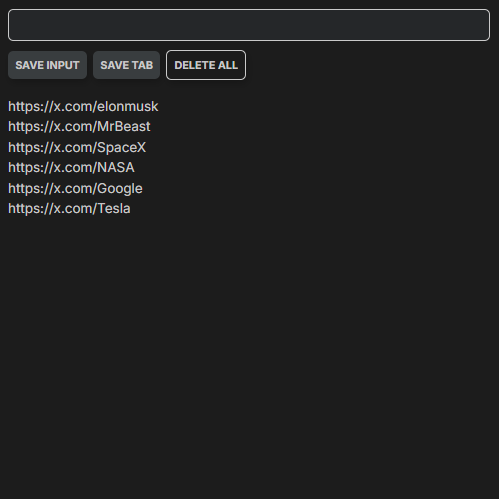

# Chrome Extension (Chrome API)

- This application allows users to save URLs either manually
- (by entering them into an input field) or automatically (by capturing the currently active tab’s URL).
- The saved URLs persist using localStorage, so they remain available even after the browser is closed.
- Users can also delete all saved URLs.


---

# Main.js Overview / Notes

**Retrieving and Rendering Saved URLs**
```javascript
// Access previously saved URLs in localStorage,
// Assigne to myLeads and displayed by calling render(myLeads).

if (leadsFromLocalStorage) {
    myLeads = leadsFromLocalStorage
    render(myLeads)
}
;
```
**Capturing and Saving the Active Tab’s URL**
```javascript
// chrome.tabs.query to get the URL of the currently active tab in the current window
// The URL is added to myLeads, saved in localStorage, and displayed using render()

tabBtn.addEventListener("click", function(){    
    chrome.tabs.query({active: true, currentWindow: true}, function(tabs){
        myLeads.push(tabs[0].url)
        localStorage.setItem("myLeads", JSON.stringify(myLeads))
        render(myLeads)
    })
})

```
**Button Functions**
```javascript
// The generated list is then inserted into ulEl.innerHTML

function render(leads) {
    let listItems = ""
    for (let i = 0; i < leads.length; i++) {
        listItems += `
            <li>
                <a target='_blank' href='${leads[i]}'>
                    ${leads[i]}
                </a>
            </li>
        `
    }
    ulEl.innerHTML = listItems
}

// Clears localStorage, resets myLeads to an empty array, and updates the displayed list

deleteBtn.addEventListener("click", function() {
    localStorage.clear()
    myLeads = []
    render(myLeads)
})

// Saves the updated list in localStorage and updates the display

inputBtn.addEventListener("click", function() {
    myLeads.push(inputEl.value)
    inputEl.value = ""
    localStorage.setItem("myLeads", JSON.stringify(myLeads))
    render(myLeads)
})


```

