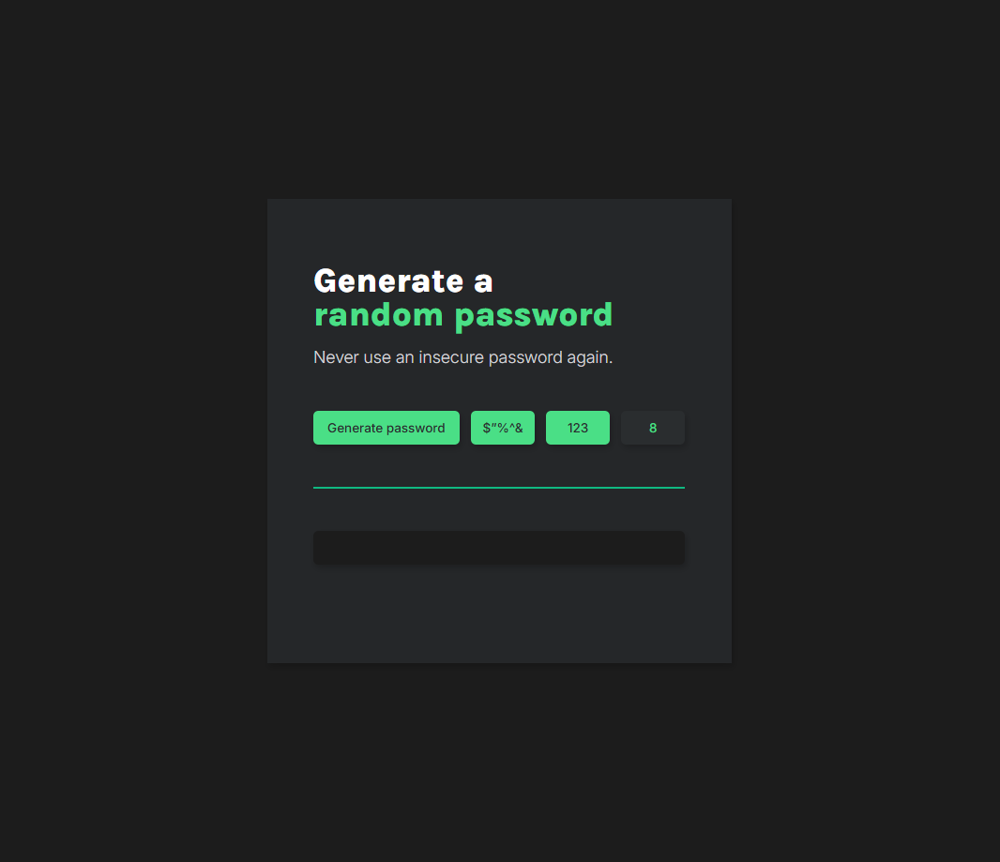

# Interactive Password Generator

- This application allows a user to generate a random password with customisable options (symbols, numbers, and length


---

# Main.js Overview / Notes

**Character Set (characters array)**
```javascript
// Stores all possible characters for the password, including:
// Uppercase letters (A-Z), Lowercase letters (a-z)
// Numbers (0-9), Symbols (~, `, !, @, #, $, etc.)

const characters = ["A", "B", "C", "D", ..., "?", "/"];
```
**Password Length Toggle Function**
```javascript
// Onclick -> Cycles between three possible values: 8 → 12 → 16 → 8.
// Updates the displayed password length.

function passwordLengthClick() {
    if (passwordLength === 8) {
        passwordLength = 12;
    } else if (passwordLength === 12) {
        passwordLength = 16;
    } else {
        passwordLength = 8;
    }
    passwordLengthValue.textContent = passwordLength;
}
```
**Password Generation Function**
```javascript
function passwordGeneration() {
    let password = "";
    let allowedCharacters = [];

    // Include symbols if enabled
    if (symbols) {
        allowedCharacters = allowedCharacters.concat(["~", "`", "!", "@", "#", "$", "%", "^", "&", "*", "(", ")", "_", "-", "+", "=", "{", "[", "}", "]", ",", "|", ":", ";", "<", ">", ".", "?", "/"]);
    }

    // Include numbers if enabled
    if (numbers) {
        allowedCharacters = allowedCharacters.concat(["0", "1", "2", "3", "4", "5", "6", "7", "8", "9"]);
    }

    // Always include letters
    allowedCharacters = allowedCharacters.concat(
        ["A", "B", "C", "D", "E", "F", "G", "H", "I", "J", "K", "L", "M", "N", "O", "P", "Q", "R", "S", "T", "U", "V", "W", "X", "Y", "Z",
            "a", "b", "c", "d", "e", "f", "g", "h", "i", "j", "k", "l", "m", "n", "o", "p", "q", "r", "s", "t", "u", "v", "w", "x", "y", "z"]
    );

    // Generate password of the selected length
    for (let i = 0; i < passwordLength; i++) {
        let randomCharacterIndex = Math.floor(Math.random() * allowedCharacters.length);
        password += allowedCharacters[randomCharacterIndex];
    }

    passwordText.textContent = password;
}
```

