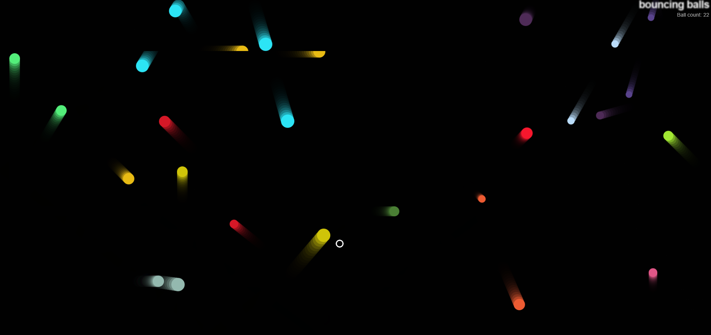

# Interactive Physics Based Ball Game

- Balls move freely and bounce off walls.
- EvilCircle is controlled by the player and removes balls upon contact.
- Collisions between balls change their colors.
- Canvas Animation is handled using requestAnimationFrame().
- Game UI displays the ball count dynamically.



---
# Main.js Overview / Notes

**Canvas Setup**
```javascript
// Selects the <canvas> elements from the DOM
// Set's up the 2D rendering context (ctx)
const canvas = document.querySelector("canvas");
const ctx = canvas.getContext("2d");
const width = (canvas.width = window.innerWidth);
const height = (canvas.height = window.innerHeight);
```
**Ball Counter Setup & Utility Functions**
```javascript
// Tracks the number of balls currently in the game.
// Updates the counter in the <p> element.
const counter = document.querySelector("p");
let count = 0;
counter.textContent = `Ball count: ${count}`;

// Generates a random number between min and max
function random(min, max) {
    return Math.floor(Math.random() * (max - min + 1)) + min;
}

// Generates a random RGB color
function randomRGB() {
    return `rgb(${random(0, 255)},${random(0, 255)},${random(0, 255)})`;
}
```
**Shape Base Class**
```javascript
// Defines a generic shape with properties for position (x, y) and velocity (velX, velY).
// The Ball and EvilCircle classes will inherit from this.
class Shape {
    constructor(x, y, velX, velY) {
        this.x = x;
        this.y = y;
        this.velX = velX;
        this.velY = velY;
    }
}
```
**Ball Class**
```javascript
// Extends Shape and adds: color(Ball colour), size(radius of ball)
// exists(tracks if the ball is still in play. Increements the ball count.
class Ball extends Shape {
    constructor(x, y, velX, velY, color, size) {
        super(x, y, velX, velY);
        this.color = color;
        this.size = size;
        this.exists = true;
        // Incrementing ball count
        count++;
        counter.textContent = `Ball count: ${count}`;
    }

// Draws the ball on the canvas
    draw() {
        ctx.beginPath();
        ctx.fillStyle = this.color;
        ctx.arc(this.x, this.y, this.size, 0, 2 * Math.PI);
        ctx.fill();

    }

// Moves the ball and makes it bounce off the edges
    update() {
        if ((this.x + this.size) >= width) {
            this.velX = -(this.velX);
        }

        if ((this.x - this.size) <= 0) {
            this.velX = -(this.velX);
        }

        if ((this.y + this.size) >= height) {
            this.velY = -(this.velY);
        }

        if ((this.y - this.size) <= 0) {
            this.velY = -(this.velY);
        }

        this.x += this.velX;
        this.y += this.velY;
    }

// Detects collisions between balls and changes their colors upon contact
    collisionDetect() {
        for (const ball of balls) {
            if (!(this === ball) && ball.exists) {
                const dx = this.x - ball.x;
                const dy = this.y - ball.y;
                const distance = Math.sqrt(dx * dx + dy * dy);

                if (distance < this.size + ball.size) {
                    ball.color = this.color = randomRGB();
                }
            }
        }
    }

}
```
**EvilCircle Class**
```javascript
// Inherits from Shape
class EvilCircle extends Shape {
    constructor(x, y) {
        super(x, y, 20, 20);
        this.color = "white";
        this.size = 10;
    
        // Moves the EvilCircle using WASD keys.
        window.addEventListener('keydown', (e) => {
          switch(e.key) {
            case 'a':
              this.x -= this.velX;
              break;
            case 'd':
              this.x += this.velX;
              break;
            case 'w':
              this.y -= this.velY;
              break;
            case 's':
              this.y += this.velY;
              break;
          }
        });
      }

// Draw copied from Ball class, added stroke.
    draw() {
        ctx.beginPath();
        ctx.strokeStyle = this.color;
        ctx.arc(this.x, this.y, this.size, 0, 2 * Math.PI);
        ctx.stroke();
        ctx.lineWidth = 3;
    }

// Keeps 'Evil Circle' within the canvas boundaries
    checkBounds() {
        if (this.x - this.size < 0) {
            this.x = this.size;
        } else if (this.x + this.size > width) {
            this.x = width - this.size;
        }

        if (this.y - this.size < 0) {
            this.y = this.size;
        } else if (this.y + this.size > height) {
            this.y = height - this.size;
        }
    }

// Collision detection with added 'count' function
    collisionDetect() {
        for (const ball of balls) {
            if (ball.exists) {
                const dx = this.x - ball.x;
                const dy = this.y - ball.y;
                const distance = Math.sqrt(dx * dx + dy * dy);

                if (distance < this.size + ball.size) {
                    ball.exists = false
                    // Decrementing ball count
                    count--;
                    counter.textContent = `Ball count: ${count}`;

                }
            }
        }
    }

}
```
**Ball Creation**
```javascript
// Ball array to store all the balls with random positions, velocities, colors and sizes
const balls = [];

while (balls.length < 25) {
    const size = random(10, 20);
    const ball = new Ball(
        // ball position always drawn at least one ball width
        // away from the edge of the canvas, to avoid drawing errors
        random(0 + size, width - size),
        random(0 + size, height - size),
        random(-7, 7),
        random(-7, 7),
        randomRGB(),
        size,
    );
    balls.push(ball);
}

// EvilCircle Creation
// Spawns the EvilCircle at a random position.
const evilBall = new EvilCircle(random(0, width), random(0, height));
```
**Game Loop**
```javascript
function loop() {
// semi-transparent black rectangle to create a motion trail effect
    ctx.fillStyle = "rgb(0 0 0 / 25%)";
    ctx.fillRect(0, 0, width, height);

// Updates and redraws each ball if it still exists
    for (const ball of balls) {
        if (ball.exists) {
            ball.draw();
            ball.update();
            ball.collisionDetect();
        }
    }

// Updates and redraws the EvilCircle
    evilBall.draw();
    evilBall.checkBounds();
    evilBall.collisionDetect();

// Calls loop() recursively to animate the game
    requestAnimationFrame(loop);
}

// Start game loop.
loop();
```
