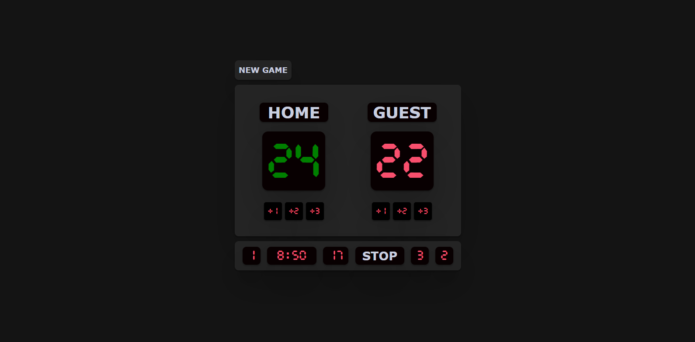

# Interactive College Basketball Scoreboard

- This application is a sports scoreboard system that tracks:
- Home & Guest scores, Period (game phases), Timers (game timer & shot clock),
- Fouls, and Start/Stop functionality.
- It provides real-time updates to the UI based on game events.


---

# Main.js Overview / Notes

**Variables (Game State)**
```javascript
let score1 = 0;                // Home team's score
let score2 = 0;                // Guest team's score
let timeLeft = 600;            // 10 minutes in seconds
let timerInterval;             // Holds the game timer interval
let period = 0;                // Tracks the current period
let shotTime = 24;             // 24-second shot clock timer
let shotTimerInterval;         // Holds the shot clock timer
let foulCount1 = 0;            // Home fouls
let foulCount2 = 0;            // Guest fouls
let isTimerRunning = true;     // Tracks if game is active/paused
```
**Timer Functions**
```javascript
// Starts the countdown from 10 minutes.
// If time reaches 0, it moves to the next period (max 2 periods).
// Calls updateTimerDisplay() every second to update the UI.

function startTimer() {
    clearInterval(timerInterval); 
    timeLeft = 600;  
    updateTimerDisplay();

    timerInterval = setInterval(() => {
        if (timeLeft > 0) {
            timeLeft--;
            updateTimerDisplay();
        } else {
            clearInterval(timerInterval);
            if (period < 2) {
                addPeriod();  
                startTimer();
            }
        }
    }, 1000);
}
```
**Shot Clock (24-second timer)**
```javascript
// Shot Clock (24-second timer)
// Resets to 24 seconds after each possession.
// Updates every second to show the countdown

function startShotClock() {
    clearInterval(shotTimerInterval); 

    shotTime = 24; 
    updateShotClockDisplay(); 

    shotTimerInterval = setInterval(() => {
        if (shotTime > 0) {
            shotTime--;
            updateShotClockDisplay();
            if (shotTime <= 24 && shotTime > 2) {
                const shotscore = document.getElementById('shot-timer');
                shotscore.style.color = '#f94f6d';
            }
            else if (shotTime <= 2 && shotTime > 1) {
                const shotscore = document.getElementById('shot-timer');
                shotscore.style.color = 'orange';
            }
            else if (shotTime <= 1 && shotTime > 0) {
                const shotscore = document.getElementById('shot-timer');
                shotscore.style.color = 'white';
            }
            else if (shotTime <= 0) {
                const shotscore = document.getElementById('shot-timer');
                shotscore.style.color = '#f94f6d';
            }
        }
        else {
            startShotClock();
        }
    }, 1000);
}

// Update the shot clock display

function updateShotClockDisplay() {
    let seconds = shotTime;
    let formattedTime = `${seconds < 10 ? '0' : ''}${seconds}`;

    document.getElementById('shot-timer').textContent = formattedTime;
}


// Update the timer display

function updateTimerDisplay() {
    let minutes = Math.floor(timeLeft / 60);
    let seconds = timeLeft % 60;
    let formattedTime = `${minutes}:${seconds < 10 ? '0' : ''}${seconds}`;

    document.getElementById('time-text').textContent = formattedTime;
}
```
**New Game Function**
```javascript
// Resets all game state variables to 0
// Ensures period starts from 1
// Restarts timers for the game & shot clock

function newGame() {
    score1 = 0;
    score2 = 0;
    document.getElementById('score-1').textContent = score1;
    document.getElementById('score-2').textContent = score2;
    foulCount1 = 0;
    foulCount2 = 0;
    document.getElementById('home-fouls-text').textContent = foulCount1;
    document.getElementById('away-fouls-text').textContent = foulCount2;
    updateScoreColor();
    if (period != 0) {
        resetPeriod();
    } else if (period == 0) {
        addPeriod();
    }

    startTimer();
    startShotClock();

    const stopText = document.getElementById("stop-text");
    stopText.textContent = "STOP";
}
```
**Stop Timer Function**
```javascript
// Stop Timer Function
// Pauses the game and shot clock
// Toggles the button text between "STOP" and "START"
// Resumes countdown from where it stopped

function stopButton() {
    const stopText = document.getElementById("stop-text");

    if (isTimerRunning) {
        // Pause the timers
        clearInterval(timerInterval);
        clearInterval(shotTimerInterval);
        stopText.textContent = "START"; // Change button text
    } else {
        // Resume the timers from the current state
        timerInterval = setInterval(() => {
            if (timeLeft > 0) {
                timeLeft--;
                updateTimerDisplay();
            } else {
                clearInterval(timerInterval);
                if (period < 2) {
                    addPeriod(); // Move to the next period
                    startTimer(); // Restart for the second period
                }
            }
        }, 1000);

        shotTimerInterval = setInterval(() => {
            if (shotTime > 0) {
                shotTime--;
                updateShotClockDisplay();
            } else {
                startShotClock();
            }
        }, 1000);

        stopText.textContent = "STOP"; // Change button text back
    }

    isTimerRunning = !isTimerRunning; // Toggle state
}
```
**Score Leader Highlight**
```javascript
// Winning Score Colour
// Highlights the leading team in green
// Resets to red if tied

function updateScoreColor() {
    const homeScore = document.getElementById('score-1');
    const guestScore = document.getElementById('score-2');

    if (score1 > score2) {
        homeScore.style.color = 'green';
        guestScore.style.color = '#f94f6d'; // Reset to default
    } else if (score2 > score1) {
        guestScore.style.color = 'green';
        homeScore.style.color = '#f94f6d'; // Reset to default
    } else {
        // If tied, reset both to default
        homeScore.style.color = '#f94f6d';
        guestScore.style.color = '#f94f6d';
    }
}
```
**Score Update Functions**
```javascript
// Individual score functions
// These functions update the score and trigger the shot clock.

function hAddScore1(score) {

    if (score1 < 99) {
        score1 += 1;
        document.getElementById('score-1').textContent = score1;
        updateScoreColor(); // Checks who is leading
        startShotClock(); // Resets shot clock on score
    }
}
```


