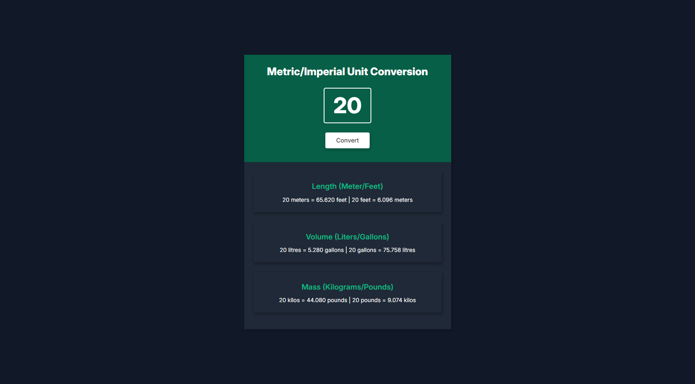

# Unit Converter Web App

- A simple JavaScript-based unit converter that allows users to convert values between different units of length, volume, and mass.
- Displays results dynamically when the user enters a value and clicks the "Convert" button.


---

# Main.js Overview / Notes

**Initialise Variables**
```javascript
const numberInput = document.getElementById('value');
const converter = document.getElementById('Converter');
const lengthText = document.getElementById('lengthText');
const volumeText = document.getElementById('volumeText');
const massText = document.getElementById('massText');
let result = 0;
```
**Conversion Event**
```javascript
converter.addEventListener("click", () => {
    // convert input to integer
    let numberValue = parseFloat(numberInput.value) || 0;  

    //Length output
    lengthText.innerText = numberValue + " meters = " + (numberValue * 3.281).toFixed(3) + " feet | " 
    + numberValue + " feet = " + (numberValue / 3.281).toFixed(3) + " meters "; 

    //Volume output
    volumeText.innerText = numberValue + " litres = " + (numberValue * 0.264).toFixed(3) + " gallons | " 
    + numberValue + " gallons = " + (numberValue / 0.264).toFixed(3) + " litres "; 

    // Mass output
    massText.innerText = numberValue + " kilos = " + (numberValue * 2.204).toFixed(3) + " pounds | " 
    + numberValue + " pounds = " + (numberValue / 2.204).toFixed(3) + " kilos "; 
});
```
